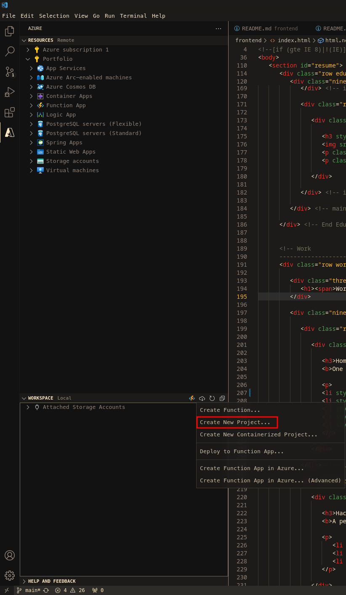

# Writeup
As a way to learn more about Microsoft Azure, I'm going to be building a website powered by Azure to showcase my resume. This project will be utilizing Azure CosmosDB, Azure Function Apps, Blob Storage, Azure CDN, as well as setting up a CI/CD pipeline with Github. This project is based off the [ACG Resume Project](https://github.com/ACloudGuru-Resources/acg-project-azure-resume-starter/tree/main) repo. That project is quite old now in computer years, so quite a few changes exist between it and this project. Now, I am by no means a web developer, so it is quite likely that the way I've done my html and CSS is not the most optimized or efficient approach, so do keep that in mind when following this guide.
# Overview
In this project, I will first set up a website locally that will host a static `index.html` with information about my resume, and a function to download the latest copy of my resume. After that I will create an Azure Function using the VS Code extension and bind it to Azure CosmosDB to keep track of page views. Once the function is running locally I will deploy it to an Azure Function app. I'll then deploy the static site to Azure Blob Storage. After that I'll use Azure CDN to create a content delivery network endpoint and map it to my static site in Blob storage. I'll then modify my DNS provider settings to forward requests to my Azure CDN endpoint. Once this is complete, I'll set up a CI/CD pipeline using Github Workflows. I'll create a frontend workflow to keep files in Azure Blob storage up to date with what's in my Github repo, and a backend workflow to run unit tests and verify my api is functional.

## Updating Index.html
The first thing I start off with is updating the `index.html` file with my information. I add links to my socials, information about my certifications and education, as well as work and volunteer experience, and change some colors.
### Certifications
For each of my certifications I add verification links with the `href` tag and to make sure they open in a new tab I add `target="_blank"`. I also change the color and the distance between each entry. The final entry for one looks like this:
```html
<!-- item start -->
            <div class="row item" style="margin-bottom: 40px">
               <div class="twelve columns">
                  <h3>Azure Administration AZ-104</h3>
                  <p class="info"><em class="date">March 2024</em></p>
                  <p class="info"><em class="date"><a href="https://learn.microsoft.com/api/credentials/share/en-us/ClaytonReardon-5708/60E89529BCC7B1D3?sharingId=D892AEAB21B31F63" target="_blank"><b>Verification</b></a></em></p>
                  <p style="color: #333333; margin-bottom: 10px;"><strong>- Identity Management and Governance:</strong> Manage Azure Identities and governance, including managing access and privileges for users and groups, as well as integration with external directories</p>
                  <p style="color: #333333; margin-bottom: 10px;"><strong>- Implement and Manage Storage:</strong> Implement storage solutions such as blob storage, file storage, and configuring access policies for cloud, and hybrid scenarios</p>
                  <p style="color: #333333; margin-bottom: 10px;"><strong>- Deploy and Manage Compute Resources:</strong> Deploy, configure, and manage virtual machines to meet the needs of various applications, workloads, and budgets</p>
                  <p style="color: #333333; margin-bottom: 10px;"><strong>- Implement and Manage Virtual Networking:</strong> Implement and manage virtual networking including virtual networks, subnets, and network security groups to ensure secure and efficient network infrastructure</p>
                  <p style="color: #333333; margin-bottom: 10px;"><strong>- Monitor and Maintain Azure Resources:</strong> Use various Azure tools to monitor and maintain Azure resources to track and maintain performance, monitor resources, and troubleshoot issues</p>
               </div>
            </div> <!-- item end -->
```

For the Security+ certification, a a verification code is needed. To make it easy for the user, I also add a function to copy the verification code to the clipboard upon clicking. I also surround the link in `<p>` tags to keep it all in one line.
```html
<!-- item start -->
            <div class="row item" style="margin-bottom: 40px">
               <div class="twelve columns">
                  <h3>CompTIA Security+</h3>
                  <p class="info"><em class="date">May 2023</em></p>
                  <p class="info"><em class="date"><a href="http://verify.CompTIA.org" target="_blank"><b>Verify</b></a> with code <span style="cursor: pointer; text-decoration: underline; color: blue;" onclick="copyToClipboard('RZZK3GHSHJB41YGR')">RZZK3GHSHJB41YGR</span></em></p>
                  <script>
                     function copyToClipboard(text) {
                       navigator.clipboard.writeText(text).then(() => {
                         alert('Code copied to clipboard!');
                       }).catch(err => {
                         console.error('Failed to copy: ', err);
                       });
                     }
                  </script>
                  <p style="color: #333333; margin-bottom: 10px;"><strong>- Identify Security Threats and Vulnerabilities:</strong> Understand and identify various types of attacks, threats, and vulnerabilities, as well as the steps necessary to mitigate them</p>
                  <p style="color: #333333; margin-bottom: 10px;"><strong>- Implement Network Security:</strong> Configuring and managing network infrastructure using technology and devices such as firewalls, VPNs, virtual networks, load balancers, and wireless security protocols, etc.</p>
                  <p style="color: #333333; margin-bottom: 10px;"><strong>- Cryptography:</strong> Knowledge of cryptographic standards, practices, and use cases for securing and authenticating communication and data</p>
                  <p style="color: #333333; margin-bottom: 10px;"><strong>- Identity and Access Management:</strong> Ability to implement access control policies and identity</p>
                  
               </div>
            </div> <!-- item end -->
```
For the work section, not much modification is needed, I just change the line spacing a bit.
```html
<!-- item start -->
            <div class="row item">
               <div class="twelve columns">
                  <h3>Harmony Event Productions</h3>
                  <p class="info">Audio Engineer/ Stagehand <span>&bull;</span> <em class="date">September 2019 - March 2020</em></p>
                  <p>
                  <li style="line-height: 1.5;">I set up staging, lighting, and sound for live events such as concerts and conferences</li>
                  <li style="line-height: 1.5;">I was responsible for live mix set up to ensure high quality sound for the performers and audience</li>
                  <li style="line-height: 1.5;">Good communication, teamwork, and camaraderie were essential for a productive and enjoyable work experience</li>
                  <li style="line-height: 1.5;">Long hours in a fast-paced, high-demand environment</li>
                  </p>
               </div>
            </div> <!-- item end -->
```
To add the "Volunteer Roles" section I just copied the work section and made some modifications.
### Download Resume Function
I also want to add a function to download the latest copy of my resume in `pdf`, `docx`, or `txt` format. I create a folder called `resume` and add the 3 files into it. In index.html I add some lines below the socials. This creates a button with 4 options, when the option changes, the corresponding file is downloaded. 

Now on it's own, this didn't look very good, so I utilized the javascript library Select2 as well as jQuery to improve it. I created a new css file called `resume.css` in the css folder. I could have added to one of the existing css files, but it felt simpler to create my own new file. At the top of `index.html`I add 2 lines to include my new css file as well as the Select2 css file. I make sure my css file is added *afterwards*. At the very bottom of `index.html` just before `</body>` and `</html>` I source 2 scripts and add one of my own.

Adding CSS links:
```html
<!-- CSS
    ================================================== -->
   <...SNIP...>
   <link rel="stylesheet" href="css/logo.css">
   <link href="https://cdnjs.cloudflare.com/ajax/libs/select2/4.0.13/css/select2.min.css" rel="stylesheet" /> <!-- Added this line -->
   <link rel="stylesheet" href="css/resume.css" />                                                            <!-- And this one -->
```
The dropdown menu HTML:
```html
<!-- Resume Download Dropdown Menu -->
            <div class="download-resume">
               <label for="resume-download">Download my resume:</label>
               <select id="resume-download" onchange="downloadFile(this.value);">
                  <option value="">Select Format</option>
                  <option value="resume/Clayton Reardon Resume.pdf">PDF</option>
                  <option value="resume/Clayton Reardon Resume.docx">Microsoft Word</option>
                  <option value="resume/Clayton Reardon Resume.txt">Text File</option>
               </select>
            </div>
            <script>
               function downloadFile(filePath) {
                 if (filePath) {
                   var link = document.createElement('a');
                   link.href = filePath;
                   link.download = filePath.substr(filePath.lastIndexOf('/') + 1);
                   document.body.appendChild(link);
                   link.click();
                   document.body.removeChild(link);
                 }
               }
            </script>
```
This script works by creating a function called `downloadFile` that accepts 1 parameter, `filePath`. It then checks the `filePath` has a valid value and creates an `<a>` anchor element (the html `<a>` element is typically used to create hyperlinks). It then sets the `href` attribute to the value of `filePath`. The `download` attribute is set to the filename extracted from taking the substring after the last `/` in `filePath`. The script then `clicks` a link which triggers the file download. After that the anchor element is removed. Essentially it takes the selected option and creates and clicks a hyperlink to download the file.

Sourcing and adding the scripts:
```html
   <script src="https://ajax.googleapis.com/ajax/libs/jquery/3.5.1/jquery.min.js"></script>
   <script src="https://cdnjs.cloudflare.com/ajax/libs/select2/4.0.13/js/select2.min.js"></script>
   <script>
      // Use custom dropdown menu
      $(document).ready(function() {
        $('#resume-download').select2({
          minimumResultsForSearch: Infinity // this option hides the search box
        });
      });
    </script>
</body>
</html>
```
`$(document).ready` ensures that the following function will only run after the HTML doc has finished loading. `$('#resume-download').select2` uses jQuery to select an HTML element and applies the Select2 plugin to that element. `minimumResultsForSearch: Infinity` hides the default search box provided by Select2. Essentially this loads the Select2 dropdown menu into the `resmue-download` element.

The `resume.css` file:
```CSS
/* Color of "Download My Resume:" */
.download-resume label {
  color: #fff;
}
/* Dropdown menu button */
.select2-container--default .select2-selection--single {
  background-color: #161415;
  border: 2px solid #fff;
  border-radius: 20px; /* Corner rounding */
  height: 40px;
  font-family: 'opensans-semibold-italic', sans-serif;
}
/* Text inside dropdown menu button */
.select2-container--default .select2-selection--single .select2-selection__rendered {
  color: #fff;
  line-height: 38px;
  padding-left: 16px;
}
/* Dropdown menu itself */
.select2-container--default .select2-dropdown {
  border-top-left-radius: 0; /* Corner rounding */
  border-top-right-radius: 0; /* Corner rounding */
  border-bottom-right-radius: 20px; /* Corner rounding */
  border-bottom-left-radius: 20px; /* Corner rounding */
  border: 1px solid #afafaf;
  background-color: #161415; 
  color: #fff; /* Text color */
}
/* Dropdown menu options */
.select2-container--default .select2-results__option {
  padding: 6px 12px; /* Padding for the options */
  color: #fff; /* Text color for the options */
}
/* Currently highlighted option */
.select2-container--default .select2-results__option--highlighted[aria-selected] {
  background-color: #444;
  color: white; /* Text color for highlighted option */
  border-radius: 8px;
}
/* Currently selected object */
.select2-container--default .select2-results__option[aria-selected="true"] {
  background-color: transparent;
  color: white; /* Text color for selected option */
  border-radius: 20px; /* Corner rounding */
  margin-top: 10px;
}
```
## Page View Counter
To implement the page view counter function, I add a file, `main.js`, file in the `/frontend/js` directory. For now I set the count variable to 30 for testing purposes, but this will eventually be linked to an Azure function. 
```js
window.addEventListener('DOMContentLoaded', (event) =>{
	getsVisitCount();
})

const functionApi = '';

const getVisitCount = () => {
	let count = 30;
	fetch(functionApi).then(response => {
		return response.json()
	}).then(response => {
		console.log("Website called function API.");
		count = response.count;
		document.getElementById("counter").innerText = count;
	}).catch(function(error){
		console.log(error);
	});
	return count;
}
```
This script sets up an event listener for the page is loaded. When the event is triggered, the `getVisitCount` function is called. 

The `getVisitCount` function defines a `count` variable with a value of 30. 

It then makes a fetch request to the URL in the `functionApi` variable (which will eventually point to Azure). 

When the fetch request returns, the `count` variable will be updated with the `count` property from the returned `json`, a message will be logged to the console, and the inner text of the element with the id "counter" will be set to the new `count` value. 

If the fetch request throws an error, the error is caught and printed to the console. And finally, it returns the `count` variable.
# Azure CosmosDB
The next step is to move on to setting up the Azure CosmosDB. Now, the ACG guide states to use the "Core (SQL)" API, however, that is no longer available. Doing some research, I figure out that the modern equivalent I need to use in the "Azure Cosmos DB for NoSQL" option. This is because I am just choosing the API, not the database type itself. The NoSQL API is the native API that still supports schema-less `json` documents and allows querying these documents with SQL syntax.


After this I move into the setup. I create a new resource group called `AzureResumeRG`, create an account name, choose the best location for me, and set the capacity mode to `Serverless`. The reason for this is that `Serverless` is better suited and more cost effective for intermittent workloads and unpredictable traffic. After selecting these options I `Review+Create` and then `Create`. 


The deployment takes a few minutes. Once it's deployed, I hit `Go To Resource`. I then go to `Data Explorer` and create a new database and title it "AzureResume"


Once the database is created I click the 3 dots next to the database name and select `NewContainer`.  I make sure I use the existing database `AzureResume`, for the container ID I use `Counter`, and for partition key I go with the recommended `/id`.


Once the container is created I expand it and create a new item. This will be for the `count` variable that will keep track of page views.
```json
{
	"id": "1",
	"count": 0
}
```


# Azure Function App
## Create Azure Function
Azure functions is a serverless compute resource that allows me to run code triggered by an event, without having to explicitly create and manage the infrastructure required for that code. It allows me to write less code, maintain less infrastructure, and save on costs. I am also able to "bind" other resources to my Azure Functions. This lets me pass data into and out of a function without having to write explicit code to do so.

So the next step is to create an Azure Function, bind Azure Cosmos DB to the function, and view my counter data via the function.

I hop back into Visual Studio Code and install the [Azure Functions extension.](https://marketplace.visualstudio.com/items?itemName=ms-azuretools.vscode-azurefunctions) Once installed, and signed in, I create a new project with `Workspace>Azure Functions>Create New Project`. 



I click `browse` and browse to `backend>api` and select the folder. For the language I select C# and the .NET 6.0 LTS runtime.  The guide was written with .NET 3.0 LTS 2 years ago, which is now EoL. I'll likely encounter some errors and bugs due to this, but so be it.

I use `HttpTrigger` as the template. I enter `GetResumeCounter` as the function name. I keep the default `Company.Function` as the namespace. I set the access rights to `Function` and then let it create. After this I have a file called `GetResumeCounter.cs` in `backend/api`.


With this file created, I can navigate to the folder containg the function, `backend/api` and start the function. It starts up as running on localhost:7071
```bash
┌──(clayton㉿Nucleus)──[18:27:38]──[~/azure-resume]
└─$ cd backend/api 

┌──(clayton㉿Nucleus)──[18:42:19]──[~/azure-resume/backend/api]
└─$ func host start                
MSBuild version 17.9.8+b34f75857 for .NET
  Determining projects to restore...
  All projects are up-to-date for restore.
  api -> /home/clayton/azure-resume/backend/api/bin/output/api.dll

Build succeeded.
    0 Warning(s)
    0 Error(s)

Time Elapsed 00:00:01.49


Azure Functions Core Tools
Core Tools Version:       4.0.5611 Commit hash: N/A +591b8aec842e333a87ea9e23ba390bb5effe0655 (64-bit)
Function Runtime Version: 4.31.1.22191

[2024-04-14T01:42:26.214Z] Found /home/clayton/azure-resume/backend/api/api.csproj. Using for user secrets file configuration.

Functions:

	GetResumeCounter: [GET,POST] http://localhost:7071/api/GetResumeCounter

For detailed output, run func with --verbose flag.
```
Browsing to `localhost:7071` I can see that my functions app is connected and running. And browsing to the API endpoint I get a message that the HTTP Trigger function executed correctly. If I pass in a GET parameter, I can see the response change.


## Binding Cosmos DB to Azure Function
Now I just need to create a binding from Cosmos DB to my function. [This page](https://learn.microsoft.com/en-us/azure/azure-functions/functions-bindings-cosmosdb-v2?tabs=isolated-process%2Cextensionv4&pivots=programming-language-csharp#supported-apis) from Microsoft has documentation on how to do this.

This first thing I need to do is install the [NuGet 4.x package](https://www.nuget.org/packages/Microsoft.Azure.Functions.Worker.Extensions.CosmosDB/). I use the .NET CLI to do this. I make sure to do it in the folder where my function is located, `backend/api`.
```bash
┌──(clayton㉿Nucleus)──[18:55:09]──[~/azure-resume/backend/api]
└─$ dotnet add package Microsoft.Azure.Functions.Worker.Extensions.CosmosDB --version 4.8.0

<...SNIP...>

info : Package 'Microsoft.Azure.Functions.Worker.Extensions.CosmosDB' is compatible with all the specified frameworks in project '/home/clayton/azure-resume/backend/api/api.csproj'.
info : PackageReference for package 'Microsoft.Azure.Functions.Worker.Extensions.CosmosDB' version '4.8.0' added to file '/home/clayton/azure-resume/backend/api/api.csproj'.
info : Writing assets file to disk. Path: /home/clayton/azure-resume/backend/api/obj/project.assets.json
log  : Restored /home/clayton/azure-resume/backend/api/api.csproj (in 4.43 sec).
```

#### Add Connection String
After this I navigate to the `backend/api/local.settings.json` file and add a key-value pair with the connection string to my CosmosDB. Make sure this file is in your .gitignore and will not be uploaded to Github. This connection string will only allow access to my CosmosDB instance, which only has view count data, but this is a security best practice for cases where you have data in the DB you really don't want anyone to access.


I also add a CORS section to `backend/api/local.settings.json`
```json
<...SNIP...>
"AzureResumeConnectionString": "AccountEndpoint=https://azureresumecosmosdb.documents.azure.com:443/;AccountKey=<REDACTED>"
},
"Host":
{
	"CORS": "*"
}
```
CORS stands for *Cross-Origin Resource Sharing*. When you deploy a website and its backend services, like Azure Functions, they're typically hosted on different domains. This results in cross-origin requests when the frontend tries to access the backend. Setting this to the wildcard `*` now just means that the site will accept requests coming from anywhere. Once the site is deployed to Azure and domain names are set, I can update this setting to only allow cross origin requests from trusted sources.
### Create C# Class
Now that the CosmosDB is set up and I have the connection string, it's time to modify the function to read and write data from the database.

I first need to define the class `Counter` within the namespace `Company.Function`. Creating a class in C# is like creating a blueprint for an object. It includes properties and methods that represent the state and behavior of the object. In this case, it's a blueprint for the `Counter` object. 

I create a file  `backend/api/Counter.cs` that will serialize and deserialize the `id` and `count` values coming in `json` messages to and from my CosmosDB database. `JsonProperty` is used to map the `C#` property names to the `json` property names when the object is serialized to and from `json`.
```C#
using Newtonsoft.Json;

namespace Company.Function
{
    public class Counter
    {
        [JsonProperty(PropertyName = "id")]
        public string Id {get; set;}
        [JsonProperty(PropertyName = "count")]
        public int Count {get; set;}
    }
}
```
### Update GetResumeCounter.cs
I need to make some modifications to the function. Whenever someone visits the site I need to grab whatever the current counter is from CosmosDB and display it to the site, and then I need to send that number +1 back to the CosmosDB. Now you might say, "hey if someone visits the site, and you display the number that was in the DB *before* they got there, won't you counter always be off by 1?" To which I would say, "That is why the counter starts at 1 rather than 0."

I add these 2 CosmosDB bindings to `GetResumeCounter.cs`
```C#
public static async Task<IActionResult> Run(
	[HttpTrigger(AuthorizationLevel.Function, "get", "post", Route = null)] HttpRequest req,
	[CosmosDB(
		databaseName: "AzureResume",
		containerName: "Counter",
		Connection = "AzureResumeConnectionString",
		Id = "1",
		PartitionKey = "1")] Counter counter,
	[CosmosDB(
		databaseName: "AzureResume",
		containerName: "Counter",
		Connection = "AzureResumeConnectionString",
		Id = "1",
		PartitionKey = "1")] IAsyncCollector<Counter> updatedCounter,
	ILogger log)
{
	log.LogInformation("C# HTTP trigger function processed a request.");
```
This function is triggered by GET or POST HTTP requests. The function interacts with the CosmosDB container `counter` in a database `AzureResume`. It retrieves and updates a document with an `id` and `partition` key of "1" using the `Counter` class. The `counter` parameter represents the data received from the database, while the `updatedCounter` parameter collects updates that are applied to the database asynchronously. Updating the database asynchronously means that the function will proceed without waiting for the update operation to complete. That means the function is free to handle other tasks or return a response wile the database is being updated in the background. This will increase responsiveness.

I also add this code at the bottom
```C#
{
	log.LogInformation("C# HTTP trigger function processed a request.");
	
	// Increment the count
    counter.Count++;
    
    // Update counter in CosmosDB
    await updatedCounter.AddAsync(counter);
    
    var jsonToReturn = JsonConvert.SerializeObject(counter);
    
    return new HttpResponseMessage(System.Net.HttpStatusCode.OK)
    {
		Content = new StringContent(jsonToReturn, Encoding.UTF8, "application/json")
    };
```
This increments the `Count` property of the `counter` object. 

It then asynchronously adds the updated `counter` value to the CosmosDB.

It serializes the `counter` object to `json` for the HTTP response body.

Finally, it creates an `HttpResponseMessage` with the status code `200 OK` and the content of the `json` string with the `counter` value.

Once this is done, I run `func host start` in `backend/api` again, and upon navigating to `localhost:7071/api/GetResumeCounter`, I get the expected output in `json` format, and upon refreshing the page, I can see the counter is working! I can also see the count value getting updated in CosmosDB


### Update main.js to Integrate Azure Function
Now to test out that everything is working, I just need to add the `localhost:7071` URL to the `main.js` function and make sure the site works. In `main.js` I add the URL to the `functionAPI` constant.
```js
const functionApi = 'http://localhost:7071/api/GetResumeCounter';
```
And upon navigating to the site, I can see that my counter is working.


# Deploying to Azure
Now that everything is working locally, it's time to deploy the site to Azure. I'll deploy my Azure function Azure, grab that URL and update `main.js` with it. I'll deploy the static site to a blob container, and I'll set up Azure CDN for HTTPS to get custom domain support.
## Deploying the Azure Function
### Create Azure Function App
In VS Code I go into the Azure Functions extension and click Terminal>Build Task... or `ctrl+shift+B` to build the function and I see it added to my local project. After that I click the lightning icon in the Azure Functions extension and select `Create Function App in Azure (Advanced)`.


I select my subscription and give it a name. I use the `.NET 6.0 LTS `runtime stack, `Linux` as the OS, select my `AzureResumeRG` resource group, and the `consumption` hosting plan. I then create a new storage account and give it a name. I create a new Application Insights resource and give it a name. Then I just wait for it to be created.


### Deploy Function to Function App
Now I need to deploy my function to my Function App. I click on the lightning bolt again and select `Deploy to Function App` and select the Function App I just created.

Next I hop into the Azure Portal and search for "Function App", I then select my recently created function app, go to the `Environment Variables` setting and click `Add Application Setting` and a variable with the name `AzureResumeConnectionString`  and the value of my CosmosDB connection string. This is because when the function is running locally, the connection string is stored in `local.settings.json`. Later on, I'll deploy all these settings to Azure, but by default settings which contain potentially sensitive data (like connection strings) will not be uploaded. Do note that for heightened security around this step, instead of pasting in the value here, I could use Azure key vault instead. But that's outside the scope of this project.


After this I select my `GetResumeCounter` function from the Function App overview, Select `Code + Test` under the Developer heading in the left side panel and select `Get Function URL`


With this URL in hand, I hop back into VS Code and update `main.js`. I add a new constant called `functionApiUrl` and update the script to use that constant. I rename the old `functionApi` to `localFunctionApi`, that way I can easily switch back to it if necessary for testing purposes.
```js
window.addEventListener('DOMContentLoaded', (event) =>{
	getVisitCount();
})

const functionApiUrl = 'https://getazureresume.azurewebsites.net/api/GetResumeCounter?code=<REDACTED>'
const localFunctionApi = 'http://localhost:7071/api/GetResumeCounter';

const getVisitCount = () => {
	let count = 30;
	fetch(functionApiUrl).then(response => {
		return response.json()
	}).then(response =>{
		console.log("Website called function API.");
		count = response.count;
		document.getElementById("counter").innerText = count;
	}).catch(function(error){
		console.log(error);
	});
	return count;
}
```
After this, I open the command pallete with F1 and type `Azure Functions: Upload Local Settings`. This will deploy all the settings stored in `local.settings.json` into the Function App environment variables.
#### Best Practices Note:
As a best practice for heightened security, the optimal method here would be to create a proxy server that only accepts requests from my site and sends requests to the Azure Function URL. This will keep the function URL and therefore the function key private. However, this will add at least an extra $12/month to the cost, over double the current price. Since this a very basic function that doesn't even accept user input, and even if it did accept user input, the most an attacker could hope to get from this is access to the CosmosDB, which only contains the site's view count, having the Function URL be public facing is not a security risk. Theoretically an attacker could spam the function URL, which would drive up the cost and potentially even DDoS the function. For my little site however, that seems pretty unlikely, but in larger scale environments, or functions dealing with more sensitive data or privileged access, a proxy server or other security methods should be used.

A way you could go about this is to create a `node.js` server locally that queries the Function URL, and then update our site's `main.js` to use this URL. First create a `server.js` file that looks something like this:
```js
const express = require('express');
const fetch = require('cross-fetch');
const cors = require('cors');
require('dotenv').config(); // This loads the environment variables from a .env file

const app = express();
const port = process.env.PORT || 3000;  // You can set the port via an environment variable or use 3000 by default

app.use(cors());
app.use(express.json());  // Middleware to parse JSON bodies

// Proxy endpoint
app.get('/api/proxy', async (req, res) => {
  const apiUrl = process.env.AZURE_FUNCTION_URL;  // Ensure this is set in your .env file or in your environment variables
  try {
    const response = await fetch(apiUrl);  // Call the Azure Function
    const data = await response.json();    // Parse the JSON response from the Azure Function
    res.send(data);  // Send the data back to the client
  } catch (error) {
    console.error('Failed to fetch from Azure Function:', error);
    res.status(500).send('Internal Server Error');
  }
});

// Start the server
app.listen(port, () => {
  console.log(`Proxy server running on port ${port}`);
});
```
and create a `.env` file in the same directory:
```
AZURE_FUNCTION_URL=<URL>
```
Make sure you install the required modules with
```bash
npm install express cross-fetch cors dotenv
```
Then start the server with `node server.js`. Update your `main.js` file to use `http://127.0.0.1:3000/api/proxy` as the Azure Function URL.

Once it's working locally You would then upload this Node.js server to an Azure Web App, and  change the URL in `main.js` to use the Web App URL. This would prevent the Function key from being viewable by the public. Having a middleware proxy server adds a layer of security because the proxy can authenticate requests, possibly checking tokens or other credentials before forwarding them to the Azure Function.
### Enable Access-Control-Allow-Credentials CORS Header
Back in the Azure Function app on the Azure Portal I go the CORS setting under the API heading in the side bar and check `Enable Access-Control-Allow-Credentials`. Once I have a domain name set and know where requests will be coming from, I can change the CORS settings to control where cross origin requests are allowed from.


# Deploying the Static Site to Blob Storage
Now that the function is deployed and working, it's time to deploy the static site frontend to Azure Blob Storage.
First things first I install the [Azure Storage](https://marketplace.visualstudio.com/items?itemName=ms-azuretools.vscode-azurestorage) extension in VS Code. After that I right-click on the front end folder and select `Deploy to Static Website via Azure Storage`.


Now when doing this I get the error "Only general purpose V2 storage accounts support static website hosting". It looks like when I created this storage account I didn't select the V2 sku. Fortunately, this is a quick fix in the Azure portal by going to StorageAccounts>{STORAGE ACCOUNT NAME}>Configuration and selecting "Upgrade". I upgrade to a General Purpose v2 storage account and select the Hot tier.


Popping back into VS code I right-click and select the Deploy to Static site option again, select my subscription and  select my storage account, I get a message stating that website hosting is not enabled for this storage account, and I select the option to enable it. I keep the index document name `index.html`. I keep `index.html` for the 404 page.

Once this is done, I let my site deploy and look at that! I can now visit in on the internet! The counter is no longer working however. Checking the developer console (F12) tells me that it's CORS causing problems.


In the Azure portal, I head back into the CORS setting in my Function App and allow the website, telling CORS to allow requests from the origin of my site. Don't forget to not include a trailing slash at the end of the URL. Once this updated, the counter works again.


## Custom Domain Name
The current domain name isn't exactly very appealing or memorable. The next step will be to set up a custom domain name, as well as SSL certificates. At this point I go out and purchase my domain name.
### Enable Azure CDN
The way Content Delivery Networks (CDNs) work is basically by caching a version of your website in servers all over the world, that way if someone in Australia accesses your site, they don't have to connect all the way to Canada, there will be a cached version for them somewhere in Australia. These caches are called point of presence (POP) nodes.

In the Azure Portal, I go to Storage Accounts>Security + Networking>Front Door and CDN and create a new endpoint. I select Azure CDN rather than Front Door, as it's more geared towards serving static sites, I create a new profile and endpoint name. I select the `Static` origin host name rather than blob. I leave the pricing tier as `Standard Microsoft`

I choose `Ignore Query String` for the query string caching behavior.  `Ignore Query String` will cause the POP node to pass the query string from the requester to the origin server on the first request and then cache the asset. All subsequent requests for that asset are served from the POP will ignore the query strings until the asset expires.
Meaning `test.aspx?q=test1` will be served from the origin server and the POP will cache the asset, and a subsequent `test.aspx?q=test2` will only be served from the POP

`Bypass caching` means that any request with a query string is served to the origin server and no assets are cached by the POP.
Meaning `test.aspx?q=test1` will be served to the origin server and *not* cached, and a subsequent `test.aspx?q=test2` will also be served to the origin server and *not* cached.

`Cache Every Unique URL` means that every request with a query string will be served to the origin server and then cached in the POP
Meaning `test.aspx?q=test1` will be served to the origin server and cached by the POP, and a subsequent `test.aspx?q=test2` will also be sent to the origin server and cached by the POP.

In our situation however, none of this matters! As our site doesn't have any endpoints that accept query strings anyways!

After hitting create, it takes a few minutes to deploy.


Once the endpoint is created I click on it, and then click on the hostname. I can now access my site through this hostname. If you get an error at this point saying something like "hey not found" wait 10 minutes or so as sometimes the CDN can take awhile to fully roll out. Also don't forget to add this hostname to your CORS settings in you Function App.


After this I went over to my DNS provider, in my case NameCheap, and added a custom record. I added a `CNAME` record with the host `www` and the value as the endpoint hostname from Azure.


Back in Azure I hit `+ Custom Domain` and added my purchased domain name. This can take some time to provision.


This record set means that when someone goes to my domain `claytonreardon.com` they will be rerouted to `https://www.claytonreardon.com` and that will point to my Azure endpoint.

Once its finished provisioning you should be greeted with a page like this by navigating to the domain over HTTP. If I instead use HTTPS and ignore all the safety warnings, I can get access to the site.


To enable HTTPS back in Azure I click on my custom domain name and flip slider to enable custom domain HTTPS. I leave the settings default. Once I hit save there are 4 steps that get completed automatically. This while take awhile, up to 2 hours to be exact, so go make a coffee.


Once this is done, I can browse to my website and verify everything is working. 


# CI/CD Pipeline.
Now, technically, everything is working and I have a functioning website. However, what if i want to make some changes to it? When I first did this project actually it wasn't until this point that I thought it would be cool to have a resume download function. What about in the future when I need to update the info on the resume? It's now time to set up a CI/CD pipeline so that I can edit the site locally, and push changes to Azure.

**CI/CD** stands for **C**ontinuous **I**ntegration **C**ontinuous **D**eployment. There are 4 major sections to this process.
1. **Version Control** - A tool like [Github Workflows](https://docs.github.com/en/actions/using-workflows/about-workflows) is used to track and manage changes made to the code
2. **Continuous Integration** - The code in version control (Github in this example) will be built, integrated, and tested in the current environment (Azure)
3. **Continuous Delivery** - Once the code has passed those tests it will be placed in a staging area where it is ready to pushed to production. Usually someone will have to go in and manually deploy this to production
4. **Continuous Deployment (optional)** - This is an optional step where once code that has passed every test enters the staging area, it will automatically be pushed to production.
## Frontend Workflow
So, to get this set up, I'll first set up a Github workflow for that will deploy the changes to Azure when a change is made to the `frontend` directory in my Github repo. I'll then create a backend workflow that will run unit tests on my Azure Function, and then deploy the backend code whenever changes are made to the `backend` directory.

So, in the top directory `azure-resume` folder, I create a hidden directory called `.github`, in there I create a directory called `workflows`. In there I create 2 files, `frontend.main.yaml` and `backend.main.yaml`
```bash
pwd
~/azure-resume

mkdir -p .github/workflows                                    

cd .github/workflows 

touch frontend.main.yaml && touch backend.main.yaml
```
Now I need to create a service principal and save the secret info to a Github Actions Secret. A service principal is basically an identity used by apps, services, and automation tools used to access specific resources. It's like a username and password/certificate, but for an application instead of a person. This service principal will have `contributor` privileges over my `AzureResumeRG` resource group. ***This is a sensitive piece of data, be careful with it.***
```bash
┌──(clayton㉿Nucleus)──[15:33:41]──[~/azure-resume/.github/workflows]
└─$ az ad sp create-for-rbac --name AzureResumeSiteDeploy --role contributor --scopes /subscriptions/79d60d7a-094d-4008-bf79-f4328565faea/resourceGroups/AzureResumeRG --json-auth
Option '--sdk-auth' has been deprecated and will be removed in a future release.
Creating 'contributor' role assignment under scope '/subscriptions/79d60d7a-094d-4008-bf79-f4328565faea/resourceGroups/AzureResumeRG'

The output includes credentials that you must protect. Be sure that you do not include these credentials in your code or check the credentials into your source control. For more information, see https://aka.ms/azadsp-cli
{
  <REDACTED>
}
```
I copy the whole output of the command. I then go to my github repo and click Settings. I go to Secrets and Variables>Actions and create a new Action Secret called `AZURE_CREDENTIALS`. I paste in the `json` output of the command and add the secret.


After this I hop over to the [Microsoft documentation](https://learn.microsoft.com/en-us/azure/storage/blobs/storage-blobs-static-site-github-actions?tabs=userlevel#add-your-workflow) about using Github workflows to deploy a static site, and copy the `yaml` from step 6 into by `.github/workflows/frontend.main.yaml` file.


I make some changes to the file. I change the name, and add a path entry that will cause the workflow to run only if changes are made to the `frontend` directory. I add the name of my storage account in the first `inlineScript` section, in the same line I change the `-s .` to `-s frontend/` to point it to the `frontend` directory in the `$web` storage container. I also add the `--overwrite` flag so that old files can be overwritten by new versions. In the `inlineScript` of the `Purge CDN endpoint` section I add in my CDN profile name, the name of my endpoint, and the resource group. 

Another function I'd like to add is a function to delete files from Azure that no longer exist in the repo. In the current setup, if I move `azure-resume/main.js` into `azure-resume/js/main.js`, a new `main.js` will be created in the `js` directory, but a copy of `main.js` will be left in the `azure-resume` directory. So I add a script that will list all the blobs in azure, sort them, and save them to a file. Then it will list all the files that exist locally and save their names to a file. After that it will compare the 2 files and any files that exist in the Azure list but not the local list will be deleted in Azure. As a precaution, you should test my code locally on the command line to make sure that this will not delete anything in Azure that it's not supposed to, but it is working for me.
```yaml
# Deploys when push is made that includes frontend directory
name: deploy_frontend

on:
    push:
        branches: [ main ]
        paths:
        - 'frontend/**'

jobs:
  build:
    runs-on: ubuntu-latest
    steps:
    - uses: actions/checkout@v3
    - uses: azure/login@v1
      with:
          creds: ${{ secrets.AZURE_CREDENTIALS }}

    - name: Upload to blob storage
      uses: azure/CLI@v1
      with:
        inlineScript: |
            az storage blob upload-batch --account-name azureresumesaclayton --auth-mode key -d '$web' -s frontend/ --overwrite
    
    - name: Remove files from Azure that are not present in repo
      uses: azure/CLI@v1
      with:
        inlineScript: |
          blobs=$(az storage blob list --container-name '$web' --account-name azureresumesaclayton --query "[].name" --output tsv | sort)
          echo "$blobs" > azure-blobs.txt

          pushd frontend
          local_files=$(find . -type f | sort | sed 's|^\./||')
          popd
          echo "$local_files" > local-files.txt

          comm -23 azure-blobs.txt local-files.txt | while read blob
          do
            az storage blob delete --container-name '$web' --name "$blob" --account-name 'azureresumesaclayton'
          done

    - name: Purge CDN endpoint
      uses: azure/CLI@v1
      with:
        inlineScript: |
           az cdn endpoint purge --content-paths  "/*" --profile-name "azureresumecdn" --name "azureresumeclayton" --resource-group "AzureResumeRG"

  # Azure logout
    - name: logout
      run: |
            az logout
      if: always()
```
Once this is done I go to the top of my repo and run
```bash
git add -A

git commit -m "<MESSAGE>"

git push 
```
After this I head over to github and go to `Actions` and I can see my workflow running


## Unit Tests & Backend Workflow
### Setup
The next step is to set up Unit Tests and integrate them into my CI/CD pipeline. Unit tests are a type of software testing where individual components or units of a software application are tested independently to ensure that they function correctly. Each unit test focuses on a small, isolated part of the codebase—usually a single function or method—to verify that it behaves as expected in various scenarios. 

In this scenario, I'm just going to be testing the counter function to make it's working as expected.

I move into my `backend/tests` folder and run
```bash
dotnet new xunit
```
After this I install Mvc with
```bash
dotnet add package Microsoft.AspNetCore.Mvc
```
Next I need to add a reference to the `api.csprog` located in the `api` directory. And I can verify that it was added by viewing `tests.csproj`
```bash
dotnet add reference ../api/api.csproj
```


At this point if I run `dotnet test`, a unit test will run and it will pass because the single `UnitTest1.cs` file doesn't really contain much. So I copy the unit tests from the ACG project resources into my `tests` directory. I also delete `UnitTest1.cs` as I don't need it.
```bash
cp ~/acs-azure-resume-start/tests/* .
rm UnitTest1.cs
```
Of these new files, all I really need to worry about is `TestCounter.cs`
```C#
using Microsoft.AspNetCore.Mvc;
using Microsoft.Extensions.Logging;
using Xunit;
using Microsoft.Azure.WebJobs;
using Microsoft.Azure.WebJobs.Extensions.Http;
using Microsoft.AspNetCore.Http;
using Microsoft.Extensions.Logging;
using Newtonsoft.Json;
using System.Net;
using System.Net.Http;
using System.Text;

namespace tests
{
    public class TestCounter
    {
        private readonly ILogger logger = TestFactory.CreateLogger();

        [Fact]
        public async void Http_trigger_should_return_known_string()
        {
            var counter = new Company.Function.Counter();
            counter.Id = "index";
            counter.Count = 2;
            var request = TestFactory.CreateHttpRequest();
            var response = (HttpResponseMessage) Company.Function.GetResumeCounter.Run(request, counter, out counter, logger);
            Assert.Equal(3, counter.Count);
        }

    }
}
```
Basically, the way this file works is that the `[Fact]` needs to be true. In this case, the code sends a value of `2` into the counter function, and it should get a `3` back, because the counter increments by 1.

Now, the test file from the ACG resources is 3 years old, and required a lot of modifications to get it working properly. I am by no means a C# expert, I'm pretty unfamiliar with it, so this took quite a bit of time tweaking, diagnosing errors, and the help of ChatGPT to get it working. Here's my final file:
```C#
using Microsoft.AspNetCore.Mvc;
using Xunit;
using Microsoft.Azure.WebJobs;
using Microsoft.Azure.WebJobs.Extensions.Http;
using Microsoft.AspNetCore.Http;
using Microsoft.Extensions.Logging;
using Newtonsoft.Json;
using System.Net;
using System.Net.Http;
using System.Text;
using Moq;
using Company.Function;

namespace tests
{
    public class TestCounter
    {
        private readonly ILogger logger = TestFactory.CreateLogger();

        [Fact]
        public async Task Http_trigger_should_return_known_string()
        {
            // Setup the Counter and Request
            var counter = new Company.Function.Counter { Id = "1", Count = 2 };

            // Create an HttpRequest instance for the test
            var request = TestFactory.CreateHttpRequest();

            // Create a mock for IAsyncCollector<Counter>
            var mockCollector = new Mock<IAsyncCollector<Counter>>();

            // Call the function
            var response = await Company.Function.GetResumeCounter.Run(request, counter, mockCollector.Object, logger);
            
            // Deserialize the response content to access the updated counter
            var content = await response.Content.ReadAsStringAsync();
            var updatedCounter = JsonConvert.DeserializeObject<Company.Function.Counter>(content);

            // Assert the incremented value
            Assert.Equal(3, updatedCounter.Count);
        }

    }
}
```
The changes I made:

1. Removed the line `using Microsoft.Extensions.Logging;` as that was throwing a Duplicate Using Directive error
2. I added `using Company.Function` to unsure that the `Counter` class could be recognized, as `Counter` is in the `Company.Function` namespace
3. Changed the return type of the test method from `void` to `Task` to support `await` and properly define it as an asynchronous test method
4. Changed the instantiation of `Counter` to use object initializer syntax, which is more concise and clear: `var counter = new Counter { Id = "1", Count = 2 };`
5. Added a mock for `IAsyncCollector<Counter>` using the Moq library to simulate the `updatedCounter` parameter expected by the `GetResumeCounter.Run` method
6. Ensured the `request` and `mockCollector` variables were declared and used correctly within the scope of the test method
7. Removed the `out` keyword when calling `GetResumeCounter.Run` as it was not expected in the method signature and corrected the type mismatch by specifying the full namespace for `Counter` where needed
8. Included deserialization of the `HttpResponseMessage` content to `Counter` to verify that the `Count` property is incremented as expected
9. Added `await` to the call to `GetResumeCounter.Run` and ensured all asynchronous operations in the test were awaited properly
10. Updated the test to assert the expected value of `Counter.Count` after the function invocation to confirm the correct behavior of the increment operation

After all these changes, running `dotnet test` gets me a pass!
```bash
┌──(clayton㉿Nucleus)──[12:48:07]──[~/azure-resume/backend/tests]
└─$ dotnet test
  Determining projects to restore...
  All projects are up-to-date for restore.
  api -> /home/clayton/azure-resume/backend/api/bin/Debug/net6.0/api.dll
/home/clayton/azure-resume/backend/tests/TestCounter.cs(40,29): warning CS8602: Dereference of a possibly null reference. [/home/clayton/azure-resume/backend/tests/tests.csproj]
  tests -> /home/clayton/azure-resume/backend/tests/bin/Debug/net8.0/tests.dll
Test run for /home/clayton/azure-resume/backend/tests/bin/Debug/net8.0/tests.dll (.NETCoreApp,Version=v8.0)
Microsoft (R) Test Execution Command Line Tool Version 17.9.0 (x64)
Copyright (c) Microsoft Corporation.  All rights reserved.

Starting test execution, please wait...
A total of 1 test files matched the specified pattern.

Passed!  - Failed:     0, Passed:     1, Skipped:     0, Total:     1, Duration: < 1 ms - tests.dll (net8.0)
```
### Integrate to backend workflow
Now I need to setup the backend Github workflow and integrate the unit tests so that they'll be run every time I make a change to the backend directory. This will verify that any changes I made didn't break anything.

I grab the yaml from [this page of Microsoft documentation](https://learn.microsoft.com/en-us/azure/azure-functions/functions-how-to-github-actions?tabs=linux%2Cdotnet&pivots=method-manual#example-workflow-configuration-file) and modify it. In the `on` section I set this workflow to only run when a `push` is made that includes anything in the `backend` directory. I change AZURE_FUNCTIONAPP_NAME to the name of my Function App (not the function itself). I add a step to login to azure with azure CLI using the creds stored in a github secret. 4. I add a section to run the Unit test.
```yaml
# Deploys when push is made that includes backend directory
name: deploy_backend

on:
  push:
    branches: [ main ]
    paths:
    - 'backend/**'

env:
  AZURE_FUNCTIONAPP_NAME: 'GetAzureResume'   # set this to your function app name on Azure
  AZURE_FUNCTIONAPP_PACKAGE_PATH: 'backend'       # set this to the path to your function app project, defaults to the repository root
  DOTNET_VERSION: '6.0.x'                   # set this to the dotnet version to use (e.g. '2.1.x', '3.1.x', '5.0.x')

jobs:
  build-and-deploy:
    runs-on: ubuntu-latest
    environment: dev
    steps:
    - name: 'Checkout GitHub Action'
      uses: actions/checkout@v3
    
    - name: 'Login via Azure CLI'
      uses: azure/login@v1
      with:
          creds: ${{ secrets.AZURE_CREDENTIALS }}

    - name: Setup DotNet ${{ env.DOTNET_VERSION }} Environment
      uses: actions/setup-dotnet@v3
      with:
        dotnet-version: ${{ env.DOTNET_VERSION }}

    - name: 'Resolve Project Dependencies Using Dotnet'
      shell: bash
      run: |
        pushd './${{ env.AZURE_FUNCTIONAPP_PACKAGE_PATH }}/api'
        dotnet build --configuration Release --output ./output
        popd
    
	- name: 'Run unit test'
      shell: pwsh
      run: |
        pushd './${{ env.AZURE_FUNCTIONAPP_PACKAGE_PATH }}/tests'
        dotnet test

    - name: 'Run Azure Functions Action'
      uses: Azure/functions-action@v1
      id: fa
      with:
        app-name: ${{ env.AZURE_FUNCTIONAPP_NAME }}
        package: '${{ env.AZURE_FUNCTIONAPP_PACKAGE_PATH }}/api/output'
```
Once these changes are made I commit and push the repo
```bash
git add -A

git commit -m "<MESSAGE>"

git push
```
I hop over to github to verify that the workflow is running.


# Wrapping Up
And that's it! I now have a site up and running on my custom domain name. It's running an Azure Function bound to CosmosDB. I can make changes locally and the CI/CD pipeline will deploy the changes to Azure.